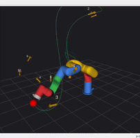
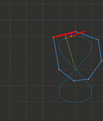
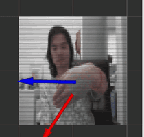

<h1 align="center">Hi 👋, I'm Pi Thanacha Choopojcharoen</h1>
<h3 align="center">PhD Researcher & Robotics Educator</h3>

📍 Waterloo, Canada · 🎓 University of Waterloo

  
  
  

  

  
  
  
  
  
  

---

### 👤 About

- 🎓 Currently pursuing a **Ph.D.** in Mechanical & Mechatronics Engineering at **University of Waterloo**
- 🔶 Previously taught robotics engineering at the Institute of Field Robotics (**FIBO**), KMUTT Thailand, for **6 years**
- 📖 **10+ years** of teaching experience; MSc/BSc in Robotics Engineering from **WPI**
- 🔭 Currently building an **Open-source Motion Capture System** (still private)
- 🎥 Sharing robotics lectures on YouTube as **Epix Studio Thailand**
- 💼 Open to: lecturing, white paper drafting, simulation work, motion data synthesis
- 📫 Reach me at **thanachachoo@gmail.com**

---

### 🔬 Technical Expertise

I work across **robotics theory, software, and education** — from kinematic modelling to teaching the next generation of robotics engineers. Below is what I've taught, built, or am currently studying in depth.

**🦾 Kinematics & Dynamics**
> Compact Inverse Kinematics · Lie Groups · Robot Modelling with URDF & XACRO · Simscape Rigid Body · Automated Dynamic Regressor Construction

**🧭 Planning, Estimation & Control**
> Time-Optimal Trajectory Planning · Invariant Kalman Filter · LQR · MPC · Adaptive Control

**🤖 ROS2 & Robotics Software**
> Package Management · Nodes, Topics, Services, Actions · TF2 · Launch System · Lifecycle Nodes · Multi-Robot & Distributed Systems

**🔭 Current Research Focus**
> Distributed optimization, control, and estimation for multi-robot and networked robotic systems

**🧠 Computer Vision & Agentic AI** *(currently learning)*
> OpenCV-based pipelines for vision-based perception · Exploring LLM-based agentic systems and their application to robotics research and tooling

**🌐 Physics Engines & Simulation**
> Interested in physics engine internals for robotics simulation · Motion data synthesis · Simulation-based teaching tools

**🏗️ Model-Based Systems Engineering**
> Interested in MBSE approaches applied to robotics system design and open-source robotics tooling

**🎥 Teaching & Content Creation**
> 10+ years teaching robotics kinematics, dynamics, state estimation, and control (FIBO, KMUTT) · Publishing robotics lecture content on YouTube — Epix Studio Thailand

**🧰 Robotics Platforms & Hardware**
> TurtleBot 4 · Yahboom ROSMASTER · DJI RoboMaster · VICON Motion Capture System · Crazyflie · Pixhawk Flight Controller

---

### 🛠️ Core Skills

**Robotics & Autonomy**

**Languages**

**Tools & Platforms**

**Robotics Hardware Platforms**

---

### 📈 GitHub Stats

  
  

